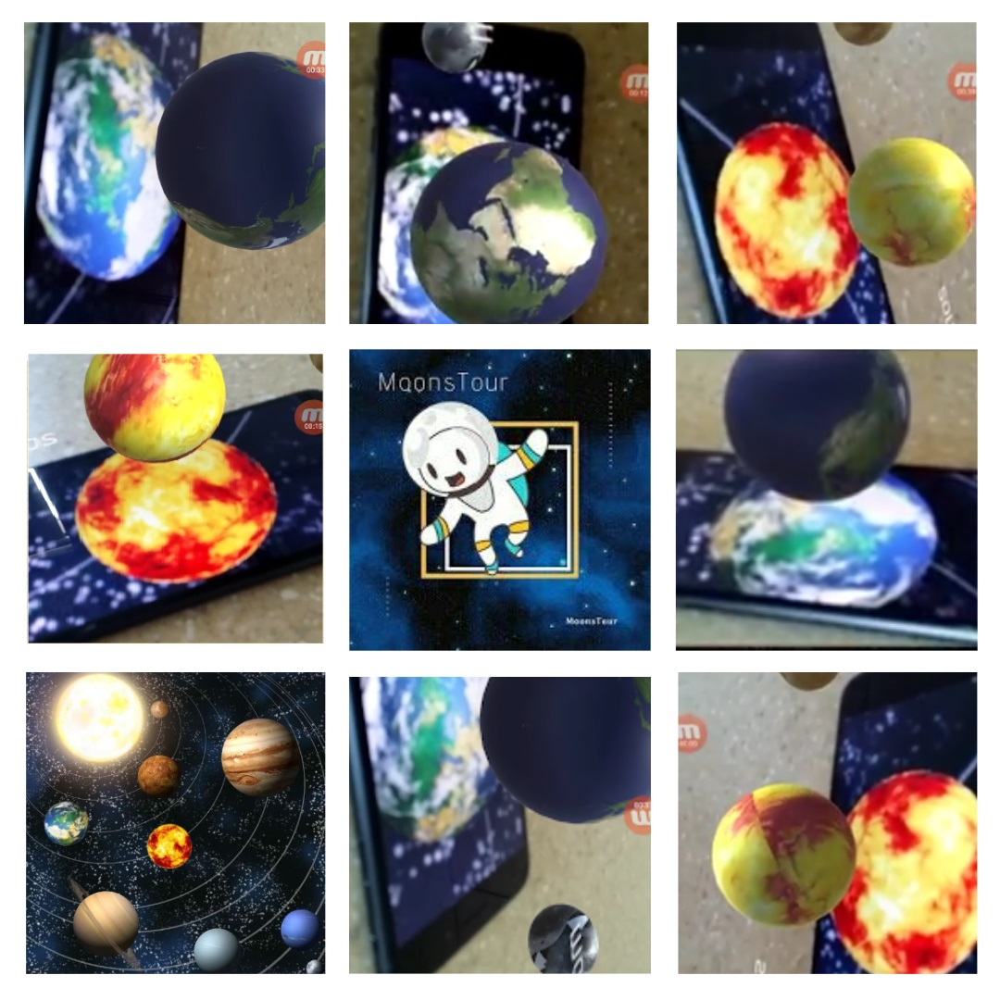

# MoonsTour

Moons Tour is Augmented Reality App aim to learn kids information about the moons and space.

Available on Google Play. Please, click  [here](https://play.google.com/store/apps/details?id=com.nasa.moonsTour).

The project is a participant in NASA's International Space Apps Challenge. Please, click  [here](https://2018.spaceappschallenge.org/challenges/universe-beauty-and-wonder/virtual-space-exploration/teams/moonstour/stream).

# Note

You have to download the images target ( key images) below to detect them by your phone's cam.Please, click  [here](https://1drv.ms/f/s!AnCwkEt7DWBgaYTM9tBe_z_exHc).

